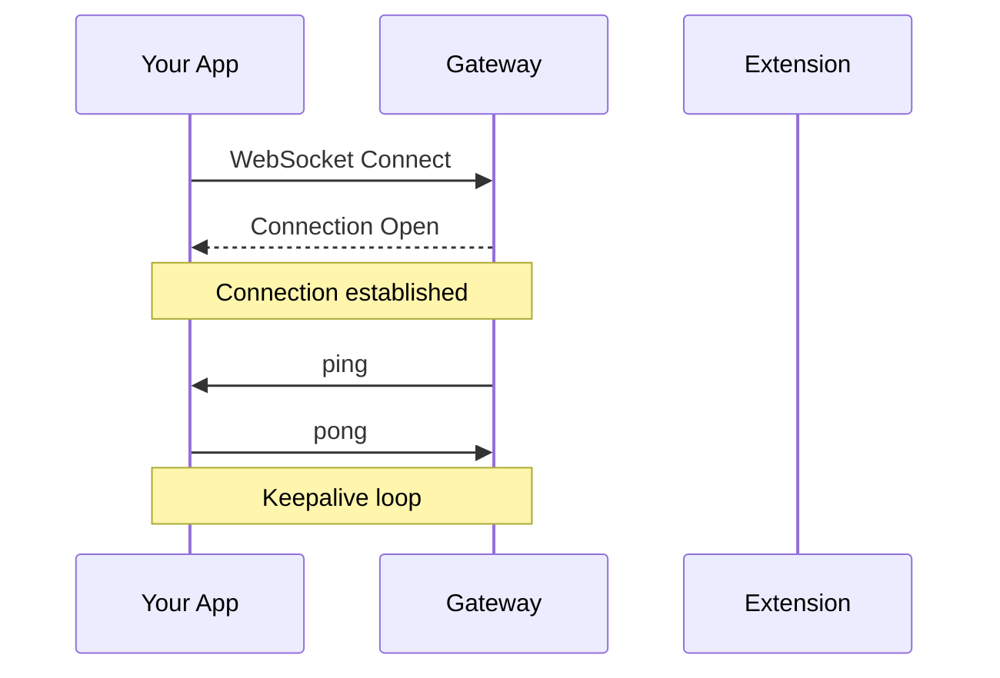

## Overview

PalanK's local API does not require authentication tokens. Security is enforced through:

1. **Local-only connections**: Only `127.0.0.1` and `localhost` are allowed
2. **Session-based**: Each browser tab attachment creates a unique session

## Sessions

### Session Creation

When the Chrome extension attaches to a tab, a session is automatically created:

```json
// Event sent from extension to your app
{
  "method": "forwardCDPEvent",
  "params": {
    "method": "Target.attachedToTarget",
    "params": {
      "sessionId": "cb-tab-1",
      "targetInfo": {
        "targetId": "ABC123",
        "type": "page",
        "title": "Google",
        "url": "https://google.com",
        "attached": true
      }
    }
  }
}
```

### Using Session IDs

Include the `sessionId` in commands to target specific tabs:

```json
{
  "id": 1,
  "method": "forwardCDPCommand",
  "params": {
    "sessionId": "cb-tab-1",
    "method": "Page.navigate",
    "params": {
      "url": "https://example.com"
    }
  }
}
```

### Session Termination

When a tab is detached or closed:

```json
// Event notification
{
  "method": "forwardCDPEvent",
  "params": {
    "method": "Target.detachedFromTarget",
    "params": {
      "sessionId": "cb-tab-1",
      "targetId": "ABC123",
      "reason": "user_detached"
    }
  }
}
```

## Connection Lifecycle

### Handshake



### Keepalive

The Gateway sends periodic `ping` messages. Respond with `pong`:

```json
// Received
{"method": "ping"}

// Send back
{"method": "pong"}
```

<Warning>
Failure to respond to `ping` messages may result in connection termination.
</Warning>

## Multiple Tabs

You can work with multiple tabs simultaneously:

```json
// Tab 1 session
{
  "id": 1,
  "method": "forwardCDPCommand",
  "params": {
    "sessionId": "cb-tab-1",
    "method": "Page.navigate",
    "params": {"url": "https://site-a.com"}
  }
}

// Tab 2 session
{
  "id": 2,
  "method": "forwardCDPCommand",
  "params": {
    "sessionId": "cb-tab-2",
    "method": "Page.navigate",
    "params": {"url": "https://site-b.com"}
  }
}
```

## Error Handling

### No Active Session

```json
{
  "id": 1,
  "error": "No attached tab for method Page.navigate"
}
```

**Solution**: Ensure the Chrome extension is attached to a tab before sending commands.

### Invalid Session ID

```json
{
  "id": 1,
  "error": "Session not found: cb-tab-99"
}
```

**Solution**: Use a valid session ID from a `Target.attachedToTarget` event.

### Connection Lost

If the WebSocket disconnects:
1. All pending commands will fail
2. Tabs remain attached in Chrome
3. Reconnect to resume operations

## Best Practices

<CardGroup cols={2}>
  <Card title="Track Sessions" icon="list">
    Maintain a list of active session IDs from attach/detach events
  </Card>
  <Card title="Handle Disconnects" icon="plug">
    Implement reconnection logic for robustness
  </Card>
  <Card title="Default Session" icon="crosshairs">
    Without sessionId, commands go to the first attached tab
  </Card>
  <Card title="Clean Up" icon="broom">
    Handle detach events to remove stale sessions
  </Card>
</CardGroup>
