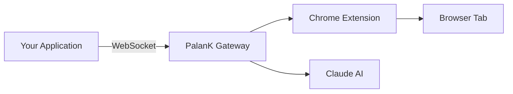

## Overview

PalanK exposes a local API that allows external applications to leverage its browser automation capabilities. The API communicates via WebSocket with the local Gateway server.

<Note>
The API is designed for local integrations only. All connections are restricted to `127.0.0.1`.
</Note>

## Architecture



## Connection

### WebSocket Endpoint

```
ws://127.0.0.1:18792/extension
```

### HTTP Health Check

```
GET http://127.0.0.1:18792/
```

Returns `200 OK` if the Gateway is running.

## Message Format

All messages use JSON format:

### Request

```json
{
  "id": 1,
  "method": "forwardCDPCommand",
  "params": {
    "method": "Page.navigate",
    "params": {
      "url": "https://example.com"
    }
  }
}
```

### Response

```json
{
  "id": 1,
  "result": {
    "frameId": "ABC123",
    "loaderId": "DEF456"
  }
}
```

### Error Response

```json
{
  "id": 1,
  "error": "No attached tab for method Page.navigate"
}
```

## Quick Start

<CodeGroup>
```javascript Node.js
const WebSocket = require('ws');

const ws = new WebSocket('ws://127.0.0.1:18792/extension');

ws.on('open', () => {
  ws.send(JSON.stringify({
    id: 1,
    method: 'forwardCDPCommand',
    params: {
      method: 'Page.navigate',
      params: { url: 'https://google.com' }
    }
  }));
});

ws.on('message', (data) => {
  console.log('Response:', JSON.parse(data));
});
```

```python Python
import websocket
import json

ws = websocket.create_connection('ws://127.0.0.1:18792/extension')

ws.send(json.dumps({
    'id': 1,
    'method': 'forwardCDPCommand',
    'params': {
        'method': 'Page.navigate',
        'params': {'url': 'https://google.com'}
    }
}))

result = json.loads(ws.recv())
print('Response:', result)

ws.close()
```
</CodeGroup>

## Available Methods

| Category | Methods |
|----------|---------|
| Navigation | `Page.navigate`, `Page.reload`, `Page.goBack`, `Page.goForward` |
| DOM | `DOM.getDocument`, `DOM.querySelector`, `DOM.getOuterHTML` |
| Input | `Input.dispatchMouseEvent`, `Input.dispatchKeyEvent` |
| Runtime | `Runtime.evaluate`, `Runtime.callFunctionOn` |
| Target | `Target.createTarget`, `Target.closeTarget`, `Target.activateTarget` |

<Info>
The API supports most [Chrome DevTools Protocol](https://chromedevtools.github.io/devtools-protocol/) methods.
</Info>

## Next Steps

<CardGroup cols={2}>
  <Card
    title="Authentication"
    icon="key"
    href="/api-reference/authentication"
  >
    Learn about session management
  </Card>
  <Card
    title="Endpoints"
    icon="route"
    href="/api-reference/endpoints"
  >
    Explore all available endpoints
  </Card>
</CardGroup>
