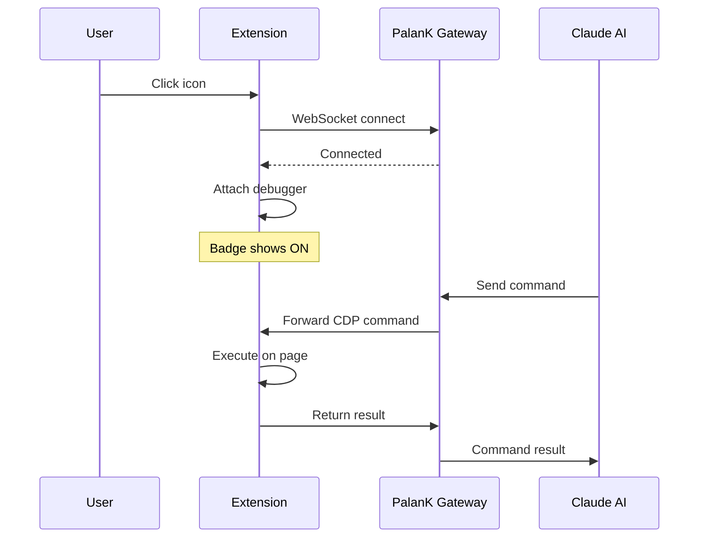

## Overview

PalanK Browser Relay is a lightweight Chrome extension that connects your browser tabs to PalanK Agent. It uses Chrome's built-in debugging protocol (CDP) to enable AI-powered browser automation.

<Info>
  The extension only activates on tabs you explicitly attach. Your browsing history and data are never collected.
</Info>

## Installation

### Chrome Web Store (Recommended)

<Card
  title="Install from Chrome Web Store"
  icon="chrome"
  href="https://chrome.google.com/webstore/detail/palank-browser-relay"
>
  One-click installation with automatic updates
</Card>

### Manual Installation (Developer Mode)

For testing or development purposes:

<Steps>
  <Step title="Download Extension">
    Download the extension files from [GitHub releases](https://github.com/PALAN-K/palank-opemclaw/releases).
  </Step>
  <Step title="Open Extensions Page">
    Navigate to `chrome://extensions` in Chrome.
  </Step>
  <Step title="Enable Developer Mode">
    Toggle "Developer mode" in the top right corner.
  </Step>
  <Step title="Load Extension">
    Click "Load unpacked" and select the extension folder.
  </Step>
</Steps>

## Usage

### Attaching a Tab

1. Navigate to the webpage you want to control
2. Click the PalanK Browser Relay icon in the toolbar
3. Wait for the badge to show "ON"

<Warning>
  Chrome will show a warning: "PalanK Browser Relay started debugging this browser". This is normal - it's how the extension controls the page.
</Warning>

### Detaching a Tab

Click the extension icon again to disconnect. The badge will disappear.

### Badge Status

| Badge | Meaning |
|-------|---------|
| **ON** (orange) | Tab is connected and ready |
| **...** (yellow) | Connecting to relay server |
| **!** (red) | Cannot reach relay - PalanK app not running |
| (none) | Tab not attached |

## Configuration

### Changing Relay Port

If you've configured PalanK to use a different port:

1. Right-click the extension icon → Options
2. Enter the new port number
3. Click Save

<Note>
  Default port is `18792`. Only change this if you've modified PalanK's CDP settings.
</Note>

## How It Works

## Permissions

The extension requires these permissions:

| Permission | Purpose |
|------------|---------|
| `debugger` | Control page via Chrome DevTools Protocol |
| `tabs` | Access current tab information |
| `activeTab` | Interact with active tab when clicked |
| `storage` | Save relay port configuration |
| `host_permissions` | Connect to local relay server |

<Check>
  All communication stays on `127.0.0.1` (localhost). No data is sent to external servers.
</Check>

## Limitations

The extension cannot control:
- Chrome internal pages (`chrome://`, `edge://`)
- Chrome Web Store pages
- Other extensions' pages
- PDF viewer

## Troubleshooting

<AccordionGroup>
  <Accordion icon="server" title="Relay not reachable">
    Make sure PalanK Desktop app is running. The extension needs the local gateway server to function.
  </Accordion>
  <Accordion icon="refresh" title="Extension stops working after Chrome update">
    Go to `chrome://extensions`, disable and re-enable the extension.
  </Accordion>
  <Accordion icon="lock" title="Page not responding to commands">
    Some pages with strict Content Security Policy may limit functionality. Try refreshing the page after attaching.
  </Accordion>
</AccordionGroup>
