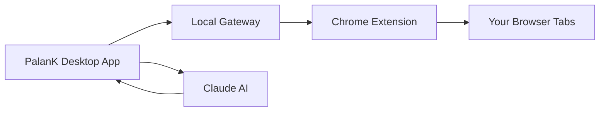

## What is PalanK Agent?

PalanK Agent is a powerful AI-powered browser automation tool for Windows. Powered by **Antigravity CLI**, it provides free access to multiple AI models including Gemini 3 Pro, Gemini 3 Flash, Claude, and more. Automate web tasks through natural language commands with your choice of AI model.

<CardGroup cols={2}>
  <Card
    title="Quick Start"
    icon="rocket"
    href="/quickstart"
  >
    Get up and running in minutes
  </Card>
  <Card
    title="Browser Extension"
    icon="puzzle-piece"
    href="/browser-extension"
  >
    Install Chrome extension for browser control
  </Card>
  <Card
    title="Features"
    icon="sparkles"
    href="/features/browser-control"
  >
    Explore all capabilities
  </Card>
  <Card
    title="API Reference"
    icon="code"
    href="/api-reference/introduction"
  >
    Integrate with your applications
  </Card>
</CardGroup>

## Key Features

<AccordionGroup>
  <Accordion icon="browser" title="Browser Automation">
    Control Chrome tabs through natural language. Click, type, scroll, and navigate - all through AI commands.
  </Accordion>
  <Accordion icon="robot" title="Multiple AI Models">
    Choose from Gemini 3 Pro, Gemini 3 Flash, Claude Opus/Sonnet/Haiku, and more. All models are free via Antigravity CLI.
  </Accordion>
  <Accordion icon="bolt" title="Local Processing">
    All processing happens on your machine. Your data stays private with no cloud dependency for browser control.
  </Accordion>
  <Accordion icon="puzzle-piece" title="Chrome Extension">
    Lightweight extension connects your existing Chrome tabs to PalanK. No separate browser needed.
  </Accordion>
</AccordionGroup>

## How It Works

1. **PalanK Desktop App** - Native Windows application with AI chat interface
2. **Local Gateway** - Secure local server for browser communication
3. **Chrome Extension** - Lightweight relay connecting browser to PalanK
4. **Claude AI** - Intelligent assistant understanding your commands

## Requirements

- Windows 10 or later
- Google Chrome browser
- Internet connection (for AI features)
- PalanK Browser Relay Chrome extension
