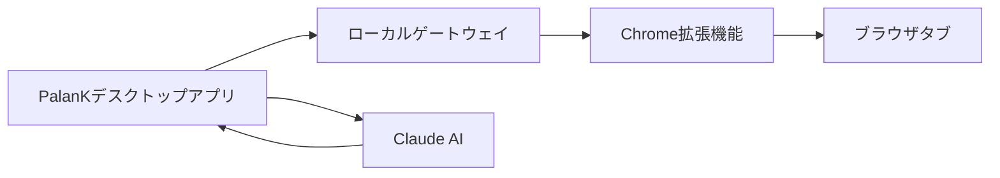

## PalanK Agentとは？

PalanK Agentは、Windows向けの強力なAI搭載ブラウザ自動化ツールです。**Antigravity CLI**により、Gemini 3 Pro、Gemini 3 Flash、Claudeなど複数のAIモデルを無料で利用できます。お好みのAIモデルを選んで、自然言語コマンドでウェブタスクを自動化しましょう。

<CardGroup cols={2}>
  <Card
    title="クイックスタート"
    icon="rocket"
    href="/ja/quickstart"
  >
    数分で始める
  </Card>
  <Card
    title="ブラウザ拡張機能"
    icon="puzzle-piece"
    href="/ja/browser-extension"
  >
    ブラウザ制御用Chrome拡張機能をインストール
  </Card>
  <Card
    title="機能"
    icon="sparkles"
    href="/ja/features/browser-control"
  >
    すべての機能を探索
  </Card>
  <Card
    title="APIリファレンス"
    icon="code"
    href="/ja/api-reference/introduction"
  >
    アプリケーションと統合
  </Card>
</CardGroup>

## 主な機能

<AccordionGroup>
  <Accordion icon="browser" title="ブラウザ自動化">
    自然言語でChromeタブを制御。クリック、入力、スクロール、ナビゲーション - すべてAIコマンドで実行できます。
  </Accordion>
  <Accordion icon="robot" title="複数のAIモデル">
    Gemini 3 Pro、Gemini 3 Flash、Claude Opus/Sonnet/Haikuなど多数のモデルから選択可能。Antigravity CLI経由ですべて無料。
  </Accordion>
  <Accordion icon="bolt" title="ローカル処理">
    すべての処理はお使いのマシンで行われます。ブラウザ制御にクラウド依存なく、データはプライベートに保たれます。
  </Accordion>
  <Accordion icon="puzzle-piece" title="Chrome拡張機能">
    軽量な拡張機能が既存のChromeタブをPalanKに接続します。別のブラウザは不要です。
  </Accordion>
</AccordionGroup>

## 動作の仕組み

1. **PalanKデスクトップアプリ** - AIチャットインターフェース付きのネイティブWindowsアプリ
2. **ローカルゲートウェイ** - ブラウザ通信用のセキュアなローカルサーバー
3. **Chrome拡張機能** - ブラウザをPalanKに接続する軽量リレー
4. **Claude AI** - コマンドを理解するインテリジェントアシスタント

## 必要条件

- Windows 10以降
- Google Chromeブラウザ
- インターネット接続（AI機能用）
- PalanK Browser Relay Chrome拡張機能
