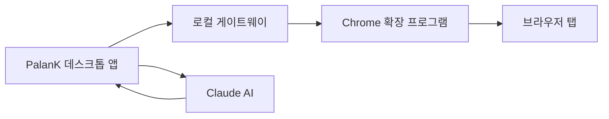

## PalanK Agent란?

PalanK Agent는 Windows용 강력한 AI 기반 브라우저 자동화 도구입니다. Claude AI의 지능과 원활한 브라우저 제어를 결합하여 자연어 명령으로 웹 작업을 자동화할 수 있습니다.

<CardGroup cols={2}>
  <Card
    title="빠른 시작"
    icon="rocket"
    href="/ko/quickstart"
  >
    몇 분 만에 시작하기
  </Card>
  <Card
    title="브라우저 확장 프로그램"
    icon="puzzle-piece"
    href="/ko/browser-extension"
  >
    브라우저 제어를 위한 Chrome 확장 프로그램 설치
  </Card>
  <Card
    title="기능"
    icon="sparkles"
    href="/ko/features/browser-control"
  >
    모든 기능 살펴보기
  </Card>
  <Card
    title="API 참조"
    icon="code"
    href="/ko/api-reference/introduction"
  >
    애플리케이션과 통합하기
  </Card>
</CardGroup>

## 주요 기능

<AccordionGroup>
  <Accordion icon="browser" title="브라우저 자동화">
    자연어로 Chrome 탭을 제어하세요. 클릭, 입력, 스크롤, 탐색 - 모두 AI 명령으로 가능합니다.
  </Accordion>
  <Accordion icon="robot" title="AI 어시스턴트">
    Claude AI가 복잡한 지시를 이해하고 다단계 웹 작업을 자동으로 실행합니다.
  </Accordion>
  <Accordion icon="bolt" title="로컬 처리">
    모든 처리는 사용자의 컴퓨터에서 이루어집니다. 브라우저 제어에 클라우드 의존성 없이 데이터가 안전하게 보호됩니다.
  </Accordion>
  <Accordion icon="puzzle-piece" title="Chrome 확장 프로그램">
    가벼운 확장 프로그램이 기존 Chrome 탭을 PalanK에 연결합니다. 별도의 브라우저가 필요 없습니다.
  </Accordion>
</AccordionGroup>

## 작동 방식

1. **PalanK 데스크톱 앱** - AI 채팅 인터페이스가 있는 Windows 네이티브 앱
2. **로컬 게이트웨이** - 브라우저 통신을 위한 안전한 로컬 서버
3. **Chrome 확장 프로그램** - 브라우저를 PalanK에 연결하는 가벼운 릴레이
4. **Claude AI** - 명령을 이해하는 지능형 어시스턴트

## 요구 사항

- Windows 10 이상
- Google Chrome 브라우저
- 인터넷 연결 (AI 기능용)
- PalanK Browser Relay Chrome 확장 프로그램
